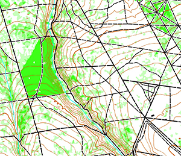

# Lidar'O

*[English version](README.md)*

## Ce que vous obtenez

**Une base de carte prête à tracer** — pas une carte terminée.

Lidar'O automatise une partie importante de la préparation d'une base cartographique à partir des données LiDAR françaises et des référentiels géographiques existants. Le cartographe conserve le dessin, la végétation, la vérification terrain et le jugement cartographique.

```
CE QUE LIDAR'O PRODUIT

    vectorisé et symbolisé :
    relief          — courbes de niveau depuis Karttapullautin
    chemins / routes  — BD TOPO
    bâtiments       — BD TOPO
    hydrographie    — BD TOPO
    terrain découvert et zones agricoles
    zones interdites

    assemblage et géoréférencement
    → fichier .omap exploitable dans OpenOrienteering Mapper

FOND DE TRACÉ

    végétation Karttapullautin, géoréférencée, intégrée au template

À FAIRE PAR LE CARTOGRAPHE

    tracer / corriger la végétation à partir du fond fourni
    relever au terrain ce que le LiDAR ne permet pas de déterminer
    ajouter les détails ponctuels et les éléments cartographiques fins
```

## Ce que Lidar'O ne produit pas

```
pas de classification automatique fiable 406 / 408 / 410
    → le signal actuellement utilisé ne fournit pas une classification fiable
      sur le terrain de test ; la végétation est fournie comme fond de tracé

pas de falaises ni de rochers
    → cliff2 et cliff3 sont désactivés : 745 traits de 2,9 m observés sur
      une seule dalle ; cliffheight et cliffangle n'ont pas été instruits

pas de détection fiable du sous-bois léger (406)
    → sur le test Grimbosq, une fenêtre contenant 45,9 % de végétation FFCO,
      dont 29 % de 406, ne produit pas de végétation exploitable dans le rendu

pas de plantations en rangs
pas de symboles ponctuels
```

## Domaine de validité

| | |
|---|---|
| **Testé** | Forêt normande de feuillus (Grimbosq) · LiDAR HD IGN · COPC · Lambert-93 · acquisition hors feuillaison |
| **Non testé** | autres types de forêt · autres régions françaises · acquisitions en feuillaison |
| **Portable** | le code déduit le CRS automatiquement ; la convergence des méridiens est calculée ; les mappings sont externalisés ; trois pays ont été traités par le pipeline |
| **Attention** | la portabilité du pipeline ne signifie pas que son réglage de végétation est validé ailleurs |



---

## Pour commencer

### Prérequis

- **Python géospatial** — recommandé via [miniconda](https://docs.conda.io/en/latest/miniconda.html) :

  ```bash
  conda install -c conda-forge geopandas shapely scipy numpy python-pdal pdal
  pip install pyyaml requests ezdxf
  ```

  Ou depuis le dépôt :

  ```bash
  pip install -e .
  # Note : gdal, python-pdal et pyogrio nécessitent conda ou un wheel précompilé
  ```

- **OpenOrienteering Mapper** — [openorienteering.org](https://www.openorienteering.org/) — pour ouvrir le `.omap` produit

- **Karttapullautin** (optionnel, pour les courbes de niveau) — [github.com/karttapullautin](https://github.com/karttapullautin/karttapullautin) — à lancer manuellement sur les dalles LiDAR, sortie dans `out_kp/`

### Données d'entrée (France)

| Donnée | Source | Emplacement |
|--------|--------|-------------|
| LiDAR HD (dalles COPC, ~500 Mo/dalle) | [IGN Géoplateforme](https://geoservices.ign.fr/lidarhd) | `LIDAR/` ou `--tiles-dir DIR` |
| BD TOPO (GPKG département) | [geoservices.ign.fr/bdtopo](https://geoservices.ign.fr/bdtopo) | `data/bdtopo/` |

**Spécifique France :** le LiDAR provient de la Géoplateforme IGN HD (format COPC), la donnée anthropique de la BD TOPO v3. Hors France, voir [docs/portabilite.md](docs/portabilite.md).

Télécharger 1–3 dalles LiDAR sur votre zone. Compter 30–60 min de traitement selon la taille de l'emprise. Une seule dalle (1×1 km) suffit pour un premier test.

### Déclarer votre terrain

```bash
# Depuis un point sur une carte (CRS déduit automatiquement)
python main.py init ma_foret --center 49.043 -0.421

# Avec bbox projetée explicite
python main.py init ma_foret --bbox 448000 6886000 451000 6889000 --crs EPSG:2154
```

`init` écrit l'entrée dans `config.yaml` et génère `assets/georef_ma_foret.xml` (convergence des
méridiens, point de référence, CRS). CRS supportés : France (2154), Estonie (3301), Grande-Bretagne
(27700), Finlande (3067), Suisse (2056), Norvège (25832/25833) — repli UTM pour les autres.

Puis lister les dalles LiDAR nécessaires :

```bash
python main.py tiles ma_foret
# → LHD_FXX_0448_6887_PTS_LAMB93_IGN69.copc.laz
#   LHD_FXX_0448_6888_PTS_LAMB93_IGN69.copc.laz  …  (France / EPSG:2154 uniquement)
# Source : https://geoservices.ign.fr/lidarhd
```

<details>
<summary>Déclaration manuelle (si vous préférez éditer config.yaml directement)</summary>

Ajouter une entrée sous `terrains:` dans `config.yaml` :

```yaml
terrains:
  ma_foret:
    bbox: [448000, 6886000, 451000, 6889000]
    crs: EPSG:2154
    departement: "14"       # code département BD TOPO — omettre hors France
```

Créer `assets/georef_ma_foret.xml` — voir `assets/` pour quatre exemples fonctionnels.
`declination` = convergence des méridiens (≠ déclinaison magnétique). Calculée automatiquement par `init`. Pour recalculer : `python -c "from pyproj import Proj; print(Proj('EPSG:2154').get_factors(lon, lat).meridian_convergence)"`. L'approximation `(longitude − méridien_central) × sin(latitude)` est fausse pour une projection conique conforme — utiliser `get_factors()`.

</details>

### Lancer le pipeline

```bash
# Vérifier dalles, CRS, georef avant traitement (appelé automatiquement par run)
python main.py check ma_foret

# Premier run — traite le LiDAR de bout en bout (30–60 min selon la taille de la zone)
python main.py ma_foret --tiles-dir LIDAR/

# Runs suivants — saute PDAL si density_hag_classified.tif existe déjà (5 min)
python main.py ma_foret --skip-pdal
```

Arborescence attendue :

```
lidar-o/
├── LIDAR/                        ← dalles .copc.laz
│   └── LHD_FXX_0448_6887_...laz
├── data/bdtopo/                  ← GPKG département BD TOPO (France uniquement)
├── out_kp/                       ← DXF Karttapullautin (optionnel, pour le relief)
├── output/                       ← créé automatiquement
│   └── ma_foret.omap             ← le résultat
└── config.yaml                   ← déclarer votre terrain ici
```

Options :

| Option | Description |
|--------|-------------|
| `--tiles-dir DIR` | Répertoire des dalles `.copc.laz` |
| `--skip-pdal` | Saute PDAL (uniquement si `density_hag_classified.tif` existe d'un run précédent) |
| `--from-step STEP` | Reprend à : `fetch`, `pdal`, `process_hag`, `vegetation`, `mask`, `assemble`, `qa` |
| `--force` | Ignore les vérifications de fraîcheur et relance toutes les étapes |

Sortie : `output/{terrain}.omap`

---

## Exemple complet (Grimbosq, France)

Déroulement complet sur une zone réelle de 2 × 3 km. À utiliser comme modèle.

### 1 — Repérer les dalles LiDAR (IGN France)

Les dalles LiDAR HD IGN sont nommées par leur **bord nord** (pas leur coin SO). La dalle `LHD_FXX_XXXX_YYYY` couvre :

```
x ∈ [XXXX × 1000, (XXXX + 1) × 1000]
y ∈ [(YYYY − 1) × 1000,  YYYY × 1000]      ← YYYY est le bord NORD
```

**Exemple** — bbox `[448000, 6886000, 450001, 6889001]` en Lambert-93 :
- colonnes x : 448, 449 → `0448`, `0449`
- lignes y : bords nord 6887, 6888, 6889 → couvre y de 6886000 à 6889000

Dalles à télécharger (6 fichiers) :
```
LHD_FXX_0448_6887_PTS_LAMB93_IGN69.copc.laz
LHD_FXX_0448_6888_PTS_LAMB93_IGN69.copc.laz
LHD_FXX_0448_6889_PTS_LAMB93_IGN69.copc.laz
LHD_FXX_0449_6887_PTS_LAMB93_IGN69.copc.laz
LHD_FXX_0449_6888_PTS_LAMB93_IGN69.copc.laz
LHD_FXX_0449_6889_PTS_LAMB93_IGN69.copc.laz
```

Télécharger depuis la [IGN Géoplateforme](https://geoservices.ign.fr/lidarhd), déposer dans `LIDAR/`.

### 2 — config.yaml

Le terrain `grimbosq` est déjà déclaré. Pour votre propre terrain, copier le template commenté en tête de la section `terrains:`.

### 3 — Créer assets/georef_grimbosq.xml

Voir le fichier `assets/georef_grimbosq.xml` existant. Pour le remplir :

| Champ | Comment l'obtenir |
|-------|-------------------|
| `ref_point x/y` | Coordonnée projetée ronde dans l'emprise (ex. 449000 / 6887000) |
| `ref_point_deg lat/lon` | Convertir sur [epsg.io/transform](https://epsg.io/transform) |
| `declination` | Convergence des méridiens au point de référence — calculée automatiquement par `init`. Pour recalculer : `python -c "from pyproj import Proj; print(Proj('EPSG:2154').get_factors(lon, lat).meridian_convergence)"`. L'approximation `(λ−λ₀)×sin(φ)` est fausse pour Lambert conique conforme — utiliser `get_factors()`. **Pas** la déclinaison magnétique. |
| `auxiliary_scale_factor` | Facteur d'échelle de la projection — 0.999966 correct pour terrain plat en Lambert-93 ; recalculer sur [epsg.io](https://epsg.io) en zone de montagne |

> **Attention au signe de `declination`** : négatif à l'ouest du méridien central, positif à l'est. Une erreur de signe décale tous les symboles de l'angle de convergence.

### 4 — Télécharger la BD TOPO (France uniquement)

Télécharger le GPKG du département 14 sur [geoservices.ign.fr/bdtopo](https://geoservices.ign.fr/bdtopo) → « Téléchargement par département » → déposer dans `data/bdtopo/`.

### 5 — Lancer

```bash
python main.py grimbosq --tiles-dir LIDAR/
```

Temps par étape (6 dalles, ~6 km², laptop récent) :

| Étape | Ce qu'elle fait | Durée |
|-------|----------------|-------|
| `fetch` | Découpe la BD TOPO sur l'emprise | < 1 min |
| `pdal` | Rasterise la densité HAG depuis le LiDAR | 20–35 min |
| `process_hag` | Normalise et classifie le raster (3 classes) | 1–2 min |
| `vegetation` | Moteur de généralisation (dissolve → lissage → coupes) | 3–5 min |
| `mask` | Supprime routes, bâtiments, terres agricoles | 1–2 min |
| `assemble` | Fusionne toutes les couches en un .omap | < 1 min |
| `qa` | Affiche les métriques de recall (si carte de référence déclarée) | < 1 min |

> Si le pipeline semble bloqué à `pdal`, il travaille — le traitement LiDAR est intensif CPU et ne produit pas de sortie intermédiaire. Attendre au moins 5 min par dalle avant de conclure à un blocage.

### 6 — Sortie attendue

Un run réussi se termine par :
```
INFO  Assemblé : output/grimbosq.omap (18 couches)
=== QA végétation — profil 'grimbosq_v0' ===
INFO  406 : n=942  cov=35%  …
INFO  408 : n=611  cov=61%  …
INFO  410 : n=465  cov=82%  …
```

> `n` et `cov` sont calculés **après clip au hull FFCO** (323,8 ha) — pas sur l'emprise totale.
> Ces valeurs varient si le profil ou les seuils changent.

Ouvrir `output/grimbosq.omap` dans OpenOrienteering Mapper. Les couches attendues :
- Fond végétation KP (aplats verts, 50 % d'opacité) — à utiliser comme décalque
- Routes, chemins, bâtiments et cours d'eau depuis la BD TOPO (symboles noirs/bleus/marron)
- Courbes de niveau de Karttapullautin (marron) — uniquement si `out_kp/` était présent

Les couches de végétation classifiées (406/408/410) sont également produites mais ne constituent
pas le livrable recommandé — utiliser le fond KP comme décalque et tracer les limites manuellement.
Voir [docs/bilan_v0.md](docs/bilan_v0.md) pour les résultats d'évaluation.

Si la carte apparaît vide ou décalée par rapport au fond de carte, vérifier que le signe de `declination` dans le fichier georef est correct.

---

## Performances de classification — mesures sur Grimbosq

> Ces chiffres décrivent la **couche de classification HAG** — qui **n'est pas le livrable principal**.
> Le livrable recommandé est le fond végétation KP utilisé comme décalque.
>
> Mesuré sur un seul terrain (Grimbosq, Calvados, France) contre une carte FFCO non redistribuable,
> sur emprise commune (hull 324 ha). Non garantis ailleurs.

| Classe | Détecté | Bonne classe |
|--------|---------|--------------|
| 406 course lente | 35 % | 28 % |
| 408 marche | 61 % | 26 % |
| 410 progression difficile | 82 % | 48 % |

*« Détecté »* = fraction de la surface FFCO couverte par n'importe quelle classe du pipeline.  
*« Bonne classe »* = fraction dans la bonne classe exacte.

---

## Domaine de validité — détail

**Classe 406 hors domaine, y compris sur Grimbosq.** AUC Mann-Whitney = 0,487 : la densité HAG[0.3–3 m] dans les zones 406 manquées est statistiquement indiscernable du terrain courable. Baisser le seuil crée autant de faux positifs qu'il ne récupère de vrais positifs.

**408/410** fonctionnent sur les forêts à structuration verticale claire (forêt tempérée dense, 61 %/82 % de détection sur Grimbosq). Testé et hors domaine : landes d'altitude, landes-marais, forêts à sous-bois uniforme.

| Terrain | Type | Résultat 406 | Cause |
|---------|------|-------------|-------|
| Grimbosq (Normandie) | Hêtraie mature | Partiel (35 %) | Signal léger indiscernable du terrain courable |
| Airelles (Pyrénées) | Lande résineux altitude | Hors domaine | Signal HAG identique entre classes FFCO |
| Kilemäed (Estonie) | Lande/forêt mixte | Hors domaine | Désaccord sémantique ouvert/couvert |
| Kuti (Estonie) | Épicéas + Vaccinium | Hors domaine | Signal uniforme dense |
| Port-en-Bessin (Normandie) | Hêtraie à sol nu | Correctement absent | Pas de sous-bois — bande HAG vide (163 retours sol/cellule) |

Voir [docs/bilan_v0.md](docs/bilan_v0.md) pour l'ensemble des expérimentations réalisées.

---

## QA et carte de référence

Le pipeline tourne sans référence (métriques QA limitées à la distribution de classes). Pour activer la comparaison quantitative :

1. Fournir sa propre carte au format GPKG ou `.omap` avec les couches `veg_406`, `veg_408`, `veg_410`
2. La déclarer dans `config.yaml` :

   ```yaml
   terrains:
     ma_foret:
       qa_reference: data/ma_carte_reference.gpkg
   ```

3. Le recall par classe et la couverture hull s'affichent en fin de run et sont sauvés dans `output/run_metadata.json`

---

## Utilisation hors de France

Le pipeline a tourné sur des données estoniennes (LiDAR COPC + OSM). Adaptations nécessaires :

- **CRS** : changer `crs` dans `config.yaml` (ex. `EPSG:3301` pour l'Estonie)
- **Géoréférencement** : créer `assets/georef_{terrain}.xml` (voir les exemples dans `assets/`)
- **Mappings** : adapter `scripts/mappings/bdtopo_isom.yaml` si la donnée anthropique ne vient pas de la BD TOPO
- **BD TOPO** : aucun équivalent direct hors France — utiliser OSM via l'option `osm_landuse` dans `config.yaml`

Voir [docs/portabilite.md](docs/portabilite.md) pour un guide détaillé.

---

## Ce que le projet a établi

Onze pistes d'amélioration ont été testées et mesurées : ajustement du seuil de détection, filtre de surface minimale, sigma gaussien, résolution de grille (1 m vs 2 m), stratégie de normalisation (fixe vs p95_local), intensité LiDAR comme signal secondaire, masque canopée, suppression de trous (deux approches), chirurgie des isthmes, sweep des seuils inter-classes. La plupart ont été réfutées par la mesure sur corpus multi-terrain.

Documentées dans [docs/bilan_v0.md](docs/bilan_v0.md) pour éviter à d'autres de refaire le chemin.

---

## Statut du projet

Publié en l'état comme travail posé — preuve de concept fonctionnelle sur forêt tempérée française.

Le pipeline fonctionne et produit des sorties utilisables, dans les limites documentées ci-dessus. Les issues GitHub seront lues mais les réponses ne sont pas garanties. Les pull requests documentant de nouveaux terrains testés ou améliorant la portabilité sont les bienvenues.

---

## Architecture

```
main.py                      orchestrateur principal (7 étapes)
config.yaml                  tous les paramètres — seuils, profils, endpoints

src/
  vegetation.py              CO Generalization Engine (9 étapes enchaînées)
  omap_writer.py             génération fichiers .omap (XML OOM)
  qa.py                      métriques QA + snapshot config
  guards.py                  détection dérives de config entre runs
  metrics.py                 calcul densités HAG (ratio, NRD)

scripts/
  fetch.py                   extraction BD TOPO depuis GPKG département
  process_hag.py             normalisation + classification raster HAG
  mask_vegetation.py         masque anthropique sur la végétation
  generate_bdtopo.py         BD TOPO → couches .omap
  generate_relief.py         DXF Karttapullautin → courbes de niveau .omap
  run_terrain.py             pipeline PDAL standalone
  measure_corpus.py          comparaison pipeline vs référence FFCO
  mappings/                  tables de correspondance ISOM (BD TOPO, KP)

scripts/diag/                scripts de calibration (historique des expérimentations)
assets/                      gabarit ISOM 2017-2, géoréférencements, CRT KP
docs/                        portabilité, bilan v0, règles IOF
```

---

## Licence et crédits

**GNU Affero General Public License v3.0** — voir [LICENSE](LICENSE).

Utilisation libre, modification libre. Tout dérivé ou service réseau doit être publié sous AGPL v3 avec le code source.

Assets tiers :
- Gabarit ISOM 2017-2 extrait d'[OpenOrienteering Mapper](https://www.openorienteering.org/) (GPL-3.0)
- Table CRT extraite de [Blaze / Trailblaze Software](https://github.com/Trailblaze-Software/Blaze) (Apache-2.0)
- [Karttapullautin](https://github.com/karttapullautin/karttapullautin) — non inclus, à télécharger séparément
