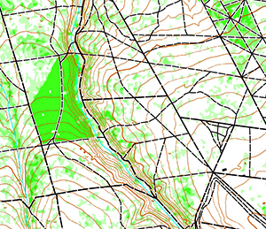

# Lidar'O

*[Version française](README.fr.md)*

Generate an ISOM base map from IGN HD LiDAR (France), output as a `.omap` file ready to open in OpenOrienteering Mapper or OCAD.



---

## Quick start

From nothing to a `.omap` file, step by step.

**1. Install prerequisites**

- [Docker Desktop](https://www.docker.com/products/docker-desktop/) — runs the pipeline, no local Python setup needed
- [OpenOrienteering Mapper](https://www.openorienteering.org/) — opens the produced `.omap`

**2. Clone and build** *(once — build takes 3–5 min)*

```bash
git clone https://github.com/guiguoz/lidar-o.git
cd lidar-o
docker build -t lidar-o .
```

> **Windows (Git Bash):** prefix every `docker run` command with `MSYS_NO_PATHCONV=1` and quote `$(pwd)` as `"$(pwd)"`.

**3. Declare your terrain**

Find your area's centre on [Géoportail](https://www.geoportail.gouv.fr/) (right-click → *Adresse/coordonnées du lieu*) or [OpenStreetMap](https://www.openstreetmap.org/) (right-click → *Show address*). Latitude and longitude in decimal degrees.

```bash
docker run --rm -v $(pwd):/app lidar-o init ma_foret --center 49.043 -0.421
```

`init` prints the exact LiDAR tile names to download, your department number for BD TOPO, and the final command — ready to copy.

**4. Download the data**

- **LiDAR tiles** — from [IGN Géoplateforme](https://geoservices.ign.fr/lidarhd), place in `LIDAR/ma_foret/`
- **BD TOPO** *(France only)* — from [geoservices.ign.fr/bdtopo](https://geoservices.ign.fr/bdtopo) → *Téléchargement par département*, place the `.gpkg` file in `data/bdtopo/`

**5. Run the pipeline**

```bash
docker run --rm -v $(pwd):/app lidar-o ma_foret --tiles-dir LIDAR/ma_foret/
```

Expected time: **30–60 min** on first run (LiDAR processing produces no output while running — this is normal). Subsequent runs with `--skip-pdal`: **5 min**.

Open `output/ma_foret.omap` in OpenOrienteering Mapper.

---

## First run — what to expect

Expected time per step (6 tiles, ~6 km², modern laptop):

| Step | What it does | Time |
|------|-------------|------|
| `fetch` | Clips BD TOPO to bbox | < 1 min |
| `pdal` | Rasterises HAG density from LiDAR | 20–35 min |
| `process_hag` | Normalises and classifies raster (3 classes) | 1–2 min |
| `vegetation` | Generalisation engine (dissolve → smooth → cut) | 3–5 min |
| `mask` | Removes roads, buildings, farmland | 1–2 min |
| `assemble` | Merges all layers into one .omap | < 1 min |
| `qa` | Prints recall metrics (if reference map declared) | < 1 min |

> If the pipeline appears stuck at `pdal`, it is working — LiDAR processing is CPU-bound and produces no intermediate output. Wait at least 5 min per tile before concluding it has hung.

A successful run ends with:

```
INFO  Assemblé : output/ma_foret.omap (18 couches)
```

Open `output/ma_foret.omap` in OpenOrienteering Mapper. You should see:
- Green vegetation polygons (slow run / walk / fight) covering the forested area
- Roads, tracks, buildings and water from BD TOPO (black/blue/brown symbols)
- Contour lines from Karttapullautin (brown) — only if KP is installed

If the map appears blank or offset from the background, check that `declination` in the georef file has the correct sign (negative west of the CRS central meridian, positive east).

---

## Getting started

### Local Python (for development)

Geospatial dependencies require pre-built wheels — recommended via [miniconda](https://docs.conda.io/en/latest/miniconda.html):

```bash
conda install -c conda-forge geopandas shapely scipy numpy python-pdal pdal
pip install pyyaml requests ezdxf
```

Or from the repository (GDAL, python-pdal and pyogrio still need conda):

```bash
pip install -e .
```

[Karttapullautin](https://github.com/karttapullautin/karttapullautin) (optional, for contours) — install separately and set `KP_BINARY=/path/to/pullauta` or add to `PATH`. Included in the Docker image.

### Declaring a terrain with explicit coordinates

If you already have projected coordinates, skip the interactive CRS confirmation:

```bash
python main.py init my_forest --bbox 448000 6886000 451000 6889000 --crs EPSG:2154
```

Supported CRS: France (2154), Estonia (3301), Great Britain (27700), Finland (3067), Switzerland (2056), Norway (25832/25833) — UTM fallback for others.

### Pre-flight check

```bash
python main.py check my_forest
```

Verifies tiles, CRS, and `assets/georef_{terrain}.xml`. Called automatically at the start of each run — run it manually to diagnose problems before committing to a 30-min run.

### Directory layout

```
lidar-o/
├── LIDAR/
│   └── my_forest/                ← put your .copc.laz tiles here
├── data/bdtopo/                  ← put the BD TOPO department GPKG here (France only)
├── out_kp_{terrain}/             ← Karttapullautin DXF (auto-generated if KP available)
├── output/                       ← created automatically
│   └── my_forest.omap
└── config.yaml
```

### Pipeline options

| Option | Description |
|--------|-------------|
| `--tiles-dir DIR` | Directory containing `.copc.laz` tiles |
| `--skip-pdal` | Skip PDAL (only if `density_hag_classified.tif` already exists from a previous run) |
| `--from-step STEP` | Resume from: `fetch`, `pdal`, `process_hag`, `relief`, `vegetation`, `mask`, `assemble`, `qa` |
| `--force` | Ignore freshness checks and rerun all steps |

---

## Reference

### IGN LiDAR tile naming (France)

`init --center` prints the tile list automatically. This section documents the naming convention for manual verification.

IGN LiDAR HD tiles are named by their **north edge** (not their SW corner). The tile `LHD_FXX_XXXX_YYYY` covers:

```
x ∈ [XXXX × 1000, (XXXX + 1) × 1000]
y ∈ [(YYYY − 1) × 1000,  YYYY × 1000]      ← YYYY is the NORTH edge
```

**Example** — bbox `[448000, 6886000, 450001, 6889001]` in Lambert-93:
- x columns needed: 448, 449 → `0448`, `0449`
- y rows needed: north edges 6887, 6888, 6889 → covers y from 6886000 to 6889000

Tiles (6 files):

```
LHD_FXX_0448_6887_PTS_LAMB93_IGN69.copc.laz
LHD_FXX_0448_6888_PTS_LAMB93_IGN69.copc.laz
LHD_FXX_0448_6889_PTS_LAMB93_IGN69.copc.laz
LHD_FXX_0449_6887_PTS_LAMB93_IGN69.copc.laz
LHD_FXX_0449_6888_PTS_LAMB93_IGN69.copc.laz
LHD_FXX_0449_6889_PTS_LAMB93_IGN69.copc.laz
```

### Georef XML

`init` generates `assets/georef_{terrain}.xml` automatically. To understand or adjust the values:

| Field | How to compute |
|-------|---------------|
| `ref_point x/y` | Any round projected coordinate inside your bbox |
| `ref_point_deg lat/lon` | Convert to WGS84 at [epsg.io/transform](https://epsg.io/transform) |
| `declination` | Meridian convergence at the ref point — computed automatically by `init`. To recompute: `python -c "from pyproj import Proj; print(Proj('EPSG:2154').get_factors(lon, lat).meridian_convergence)"`. The approximation `(λ−λ₀)×sin(φ)` is wrong for Lambert conformal conic — use `get_factors()`. **Not** magnetic declination. |
| `auxiliary_scale_factor` | Projection scale factor — 0.999966 for flat terrain in Lambert-93 |

> `declination` is negative west of the central meridian, positive east. Getting the sign wrong shifts every symbol by the convergence angle.

---

## What the tool detects

> Measured on **one terrain only** (Grimbosq forest, Calvados, France), against an FFCO reference
> map, over the common extent (convex hull, 324 ha). These figures are not guaranteed elsewhere.

| Class | Detected | Correct class |
|-------|---------|---------------|
| 406 slow run | 35 % | 28 % |
| 408 walk | 61 % | 26 % |
| 410 fight | 82 % | 48 % |

*"Detected"* = fraction of the FFCO reference area covered by any pipeline class — what the mapper does not need to draw.  
*"Correct class"* = fraction covered by the exact right class — what needs no retouching at all.  
Fixing the symbol takes two clicks in OCAD/OOM; drawing a missing polygon from scratch takes much longer.

*These metrics were measured against a non-redistributable reference map — the figures cannot be reproduced from this repository.*

---

## Validity domain

The pipeline has been tested on 5 terrains. The HAG[0.3–3 m] signal separates dense vegetation well; it is insufficient for light, runnable undergrowth.

| Terrain | Type | Result on 406 | Cause |
|---------|------|--------------|-------|
| Grimbosq (Normandy) | Mature beech forest | Partial (35 %) | Light signal indistinguishable from open ground |
| Airelles (Pyrenees) | High-altitude heath | Out of domain | HAG signal identical across FFCO classes |
| Kilemäed (Estonia) | Heath/mixed forest | Out of domain | Semantic mismatch open/covered |
| Kuti (Estonia) | Spruce + Vaccinium | Out of domain | Uniformly dense signal |
| Port-en-Bessin (Normandy) | Bare beech forest | Correctly absent | No understory — HAG band empty (163 ground returns/cell) |

**Class 406 is out of domain, including on Grimbosq.** Mann-Whitney AUC = 0.487: the HAG[0.3–3 m] density in missed 406 zones is statistically indistinguishable from runnable open terrain. Lowering the threshold creates as many false positives as it recovers true ones.

**408/410 are in domain** on forests with clear vertical structure (dense temperate forest, 61 %/82 % detection). Tested and out of domain: high-altitude heath, bog-heath, forests with uniform understory.

---

## QA and reference map

The pipeline runs without a reference map (QA metrics fall back to class distribution only). To enable quantitative comparison:

1. Provide your own map as GPKG or `.omap` with layers `veg_406`, `veg_408`, `veg_410`
2. Declare it in `config.yaml`:

   ```yaml
   terrains:
     grimbosq:
       qa_reference: data/my_reference_map.gpkg
   ```

3. Recall by class and hull coverage are printed at the end of the run and saved to `output/run_metadata.json`

---

## Using outside France

The pipeline has run on Estonian data (COPC LiDAR + OSM). Adaptations needed:

- **CRS**: change `crs` in `config.yaml` (e.g. `EPSG:3301` for Estonia)
- **Georeferencing**: create `assets/georef_{terrain}.xml` (see examples in `assets/`)
- **Mappings**: adapt `scripts/mappings/bdtopo_isom.yaml` if anthropic data does not come from BD TOPO
- **BD TOPO**: no direct equivalent outside France — use OSM via the `osm_landuse` option in `config.yaml`

See [docs/portabilite.md](docs/portabilite.md) for a detailed guide.

To add tile auto-discovery for a new country, create `src/providers/<country>.py` implementing `list_tiles(bbox, crs)` — see [CONTRIBUTING.md](CONTRIBUTING.md).

---

## What this project has established

Eleven improvement directions were tested and measured: detection threshold tuning, minimum area filtering, Gaussian sigma, grid resolution (1 m vs 2 m), normalization strategy (fixed vs p95_local), LiDAR intensity as a secondary signal, canopy mask, hole removal (two approaches), isthmus surgery, and inter-class threshold sweep. Most were refuted by measurement on a multi-terrain corpus.

Documented in [docs/bilan_v0.md](docs/bilan_v0.md) to save others from repeating the same experiments.

---

## Project status

Published as-is — a working proof of concept on French temperate forest.

The pipeline produces usable output within the documented limits. GitHub issues will be read but responses are not guaranteed. Pull requests documenting new tested terrains or improving portability are welcome.

---

## Architecture

```
main.py                      subcommands: init / tiles / check / run (8 steps)
config.yaml                  all parameters — thresholds, profiles, endpoints

src/
  vegetation.py              CO Generalization Engine (9 chained steps)
  omap_writer.py             .omap file generation (OOM XML)
  qa.py                      QA metrics + config snapshot
  guards.py                  config drift detection between runs
  metrics.py                 HAG density computation (ratio, NRD)
  run_engine.py              Karttapullautin: locate binary, build ini, run, verify DXF
  init_terrain.py            init: CRS detection, bbox, georef XML, config.yaml
  check_terrain.py           pre-flight validation (tiles, CRS, georef)
  providers/                 tile auto-discovery by country — add a country: one new file here
    france.py                IGN LiDAR HD tile names from bbox (EPSG:2154)

scripts/
  fetch.py                   BD TOPO extraction from department GPKG
  process_hag.py             HAG raster normalisation + classification
  mask_vegetation.py         anthropic mask on vegetation layers
  generate_bdtopo.py         BD TOPO → .omap layers
  generate_relief.py         KP DXF output → contour .omap layer (runs after run_engine)
  run_terrain.py             standalone PDAL pipeline
  measure_corpus.py          pipeline vs FFCO reference comparison
  mappings/                  ISOM symbol mapping tables (BD TOPO, KP)

scripts/diag/                calibration scripts (experiment history)
assets/                      ISOM 2017-2 template, georef files, KP CRT
docs/                        portability guide, v0 findings, IOF rules
```

---

## License and credits

**GNU Affero General Public License v3.0** — see [LICENSE](LICENSE).

Free to use and modify. Any derivative or network service must be published under AGPL v3 with source code.

Third-party assets:
- ISOM 2017-2 symbol template from [OpenOrienteering Mapper](https://www.openorienteering.org/) (GPL-3.0)
- CRT table from [Blaze / Trailblaze Software](https://github.com/Trailblaze-Software/Blaze) (Apache-2.0)
- [Karttapullautin](https://github.com/karttapullautin/karttapullautin) — not included, download separately
