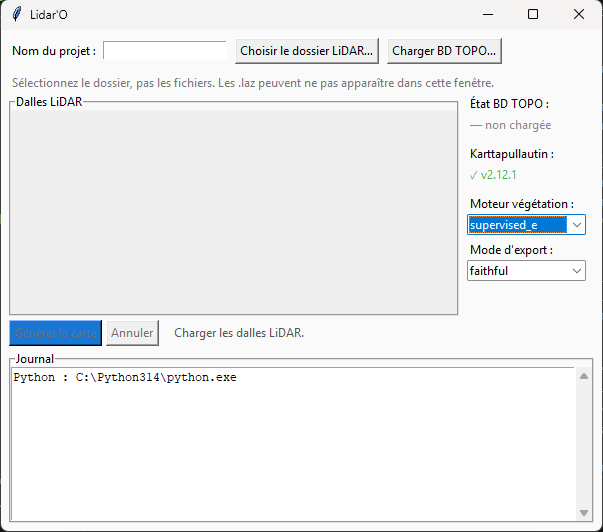
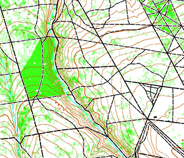

# Lidar'O

*[Version française](README.fr.md)*

**Lidar'O automatically generates an orienteering base map** from LiDAR data and geographic databases.
It produces a `.omap` file ready to open in OpenOrienteering Mapper, with contours, roads, hydrography, and a first vegetation estimate.

The mapper retains field verification, vegetation correction, and fine detail work.

> **Full documentation in French** — see [README.fr.md](README.fr.md) and [docs/guide_utilisateur.md](docs/guide_utilisateur.md)

---


*Lidar'O GUI — LiDAR / BD TOPO selectors, vegetation engine and export mode*


*Lidar'O output opened in OpenOrienteering Mapper — Grimbosq terrain (Normandy, France)*

---

## What Lidar'O produces

```
vectorised and symbolised:
  contour lines       — from Karttapullautin
  tracks / roads      — BD TOPO
  buildings           — BD TOPO
  hydrography         — BD TOPO
  open land and agricultural areas
  out-of-bounds areas
  vegetation 406 / 408 / 410  — automatic estimate (see vegetation modes below)

assembled and georeferenced
→ .omap file, ready to open in OpenOrienteering Mapper
```

## What Lidar'O does not produce

- Cliffs or boulders (symbols 201/202 disabled)
- Point features or plantation rows
- A finished map — the automatic vegetation is a base to correct in the field

---

## Vegetation modes

| Mode | Principle | Status |
|---|---|---|
| `kp` (default) | Karttapullautin extracts a vegetation image from LiDAR; layers 406/408/410 are vectorised from that image. | Stable |
| `supervised_e` | Direct classification from the vertical structure of the point cloud — 4 levels (401/406/408/410). Variable performance depending on forest type. | Experimental |

Both modes run autonomously from LiDAR data, without any external cartographic reference at inference time.

> **Mode supervised_e** requires a 786 MB pre-trained model file (`experiments/loto_v1/final_model/model_e_final.pkl`), not distributed in this repository. Without it, mode `kp` works normally. See [docs/supervised_e.md](docs/supervised_e.md).

**Export mode** (`vegetation_export_mode`, `supervised_e` only):

| Value | Effect |
|---|---|
| `faithful` (default) | Detected polygons exported as-is — no loss, noisy output |
| `generalized` | Geometric simplification (MMU + smoothing) — clean cartographic output |

---

## Installation

**No installer available** — source installation only.

### Quick setup (Windows)

```bat
rem Clone
git clone https://github.com/guiguoz/lidar-o.git
cd lidar-o

rem Install geospatial Python (Miniconda Prompt)
conda install -c conda-forge python=3.11 geopandas shapely scipy numpy ^
    python-pdal pdal rasterio ezdxf requests pyyaml
```

### Input data (France)

| Data | Source | Location |
|---|---|---|
| LiDAR HD tiles (`*.copc.laz`) | [IGN Géoplateforme](https://geoservices.ign.fr/lidarhd) | `LIDAR/` or `--tiles-dir DIR` |
| BD TOPO (department GPKG) | [geoservices.ign.fr/bdtopo](https://geoservices.ign.fr/bdtopo) | `data/bdtopo/` |

---

## Quick start

```bash
python main.py gui
```

1. **Project name** — type a name (e.g. `my_forest`)
2. **Choose LiDAR folder…** — select the folder containing your `.copc.laz` tiles
3. **Load BD TOPO…** — select the department `.gpkg` file
4. **Generate**

Output: `output/my_forest.omap` — open in OpenOrienteering Mapper.

The project is created automatically in `config.yaml` from the IGN tile filenames. No command-line setup needed for standard IGN France data.

### CLI (advanced / non-IGN data)

```bash
python main.py init my_forest --center 49.043 -0.421  # declare terrain
python main.py setup my_forest                         # interactive config
python main.py run my_forest --tiles-dir LIDAR/        # run pipeline
```

Use the CLI for non-IGN coordinates, custom bounding boxes, or scripted workflows.

---

## Validity domain

| | |
|---|---|
| **Tested** | Normandy deciduous forest — IGN HD LiDAR — COPC — Lambert-93 — leaf-off acquisition |
| **Not tested** | Mountain forests, heathlands, dense conifers, leaf-on acquisitions |
| **Portable** | CRS auto-detected; meridian convergence computed; two countries tested (France, Estonia) |
| **Note** | Code portability does not guarantee vegetation quality outside the tested domain |

---

## Full guide

→ [docs/guide_utilisateur.md](docs/guide_utilisateur.md) (French) — step-by-step installation, configuration, example, troubleshooting
→ [BD TOPO download guide](docs/guide_utilisateur.md#télécharger-et-préparer-la-bd-topo-france-uniquement) — format, department selection, extraction

Technical documentation:
- [docs/supervised_e.md](docs/supervised_e.md) — supervised_e mode: architecture, model, LOTO results
- [docs/portabilite.md](docs/portabilite.md) — usage outside France
- [docs/bilan_v0.md](docs/bilan_v0.md) — evaluation results and experimental history

---

## Architecture

```
main.py                   CLI + GUI (python main.py run / gui)
config.yaml               terrain and pipeline parameters

src/
  vegetation.py           CO Generalization Engine (kp/hag mode)
  supervised_e.py         vegetation detection from LiDAR (supervised_e mode)
  omap_writer.py          .omap generation
  pipeline_mode.py        vegetation mode resolution

gui/
  app.py                  tkinter interface
  worker.py               pipeline thread

scripts/                  fetch BD TOPO, process HAG, contours
assets/                   ISOM 2017-2 template, georef files
docs/                     user and technical guides
experiments/              supervised_e training and experiments
```

---

## Licence and credits

**GNU Affero General Public License v3.0** — see [LICENSE](LICENSE).

Third-party assets:
- ISOM 2017-2 template from [OpenOrienteering Mapper](https://www.openorienteering.org/) (GPL-3.0)
- CRT table from [Blaze / Trailblaze Software](https://github.com/Trailblaze-Software/Blaze) (GPL-3.0)
- [Karttapullautin](https://github.com/karttapullautin/karttapullautin) — not bundled, downloaded automatically by `setup`
